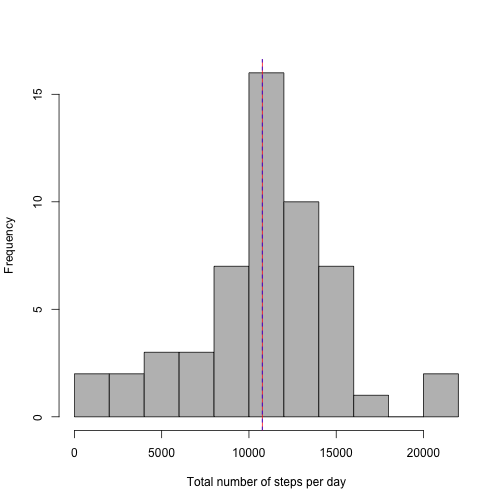
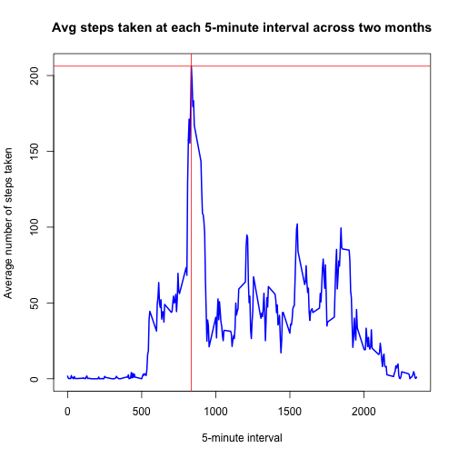
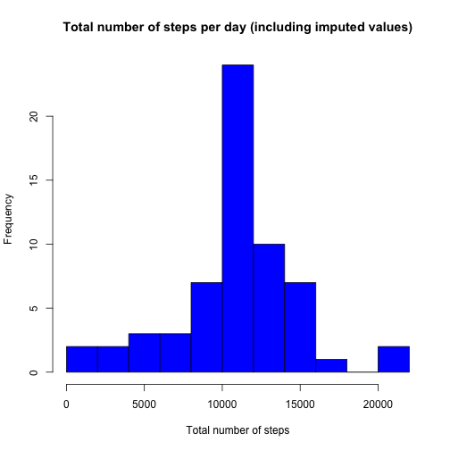
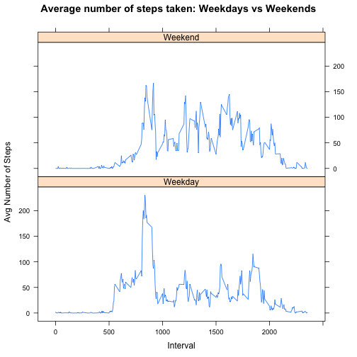

## Introduction

It is now possible to collect a large amount of data about personal movement using activity monitoring devices such as a Fitbit, Nike Fuelband, or Jawbone Up. These type of devices are part of the “quantified self” movement – a group of enthusiasts who take measurements about themselves regularly to improve their health, to find patterns in their behavior, or because they are tech geeks. But these data remain under-utilized both because the raw data are hard to obtain and there is a lack of statistical methods and software for processing and interpreting the data.

This assignment makes use of data from a personal activity monitoring device. This device collects data at 5 minute intervals through out the day. The data consists of two months of data from an anonymous individual collected during the months of October and November, 2012 and include the number of steps taken in 5 minute intervals each day.

## Data

The data for this assignment can be downloaded from the following link: [Activity monitoring data](https://d396qusza40orc.cloudfront.net/repdata%2Fdata%2Factivity.zip)

The variables included in this dataset are:

* steps: Number of steps taking in a 5-minute interval (missing values are coded as 𝙽𝙰)

* date: The date on which the measurement was taken in YYYY-MM-DD format

* interval: Identifier for the 5-minute interval in which measurement was taken

The dataset is stored in a comma-separated-value (CSV) file and there are a total of 17,568 observations in this dataset.

## Loading packages


```r
library(knitr)
library(lattice)
library(dplyr)
```

## Loading and preprocessing the data

Load the activity data using read.csv() and begin processing/transforming the data into
a format suitable for the analysis


```r
unzip("activity.zip")
data <- read.csv("activity.csv", na.strings = "NA")
data$date <- as.Date(data$date, format = "%Y-%m-%d")
```

Basic information about the data:


```r
dim(data)
```

```
## [1] 17568     3
```

```r
head(data)
```

```
##   steps       date interval
## 1    NA 2012-10-01        0
## 2    NA 2012-10-01        5
## 3    NA 2012-10-01       10
## 4    NA 2012-10-01       15
## 5    NA 2012-10-01       20
## 6    NA 2012-10-01       25
```

```r
str(data)
```

```
## 'data.frame':	17568 obs. of  3 variables:
##  $ steps   : int  NA NA NA NA NA NA NA NA NA NA ...
##  $ date    : Date, format: "2012-10-01" "2012-10-01" ...
##  $ interval: int  0 5 10 15 20 25 30 35 40 45 ...
```

```r
summary(data)
```

```
##      steps             date               interval     
##  Min.   :  0.00   Min.   :2012-10-01   Min.   :   0.0  
##  1st Qu.:  0.00   1st Qu.:2012-10-16   1st Qu.: 588.8  
##  Median :  0.00   Median :2012-10-31   Median :1177.5  
##  Mean   : 37.38   Mean   :2012-10-31   Mean   :1177.5  
##  3rd Qu.: 12.00   3rd Qu.:2012-11-15   3rd Qu.:1766.2  
##  Max.   :806.00   Max.   :2012-11-30   Max.   :2355.0  
##  NA's   :2304
```

Remove missing values (NA)


```r
completedata <- subset(data, steps != "NA")
dim(completedata)
```

```
## [1] 15264     3
```

```r
summary(completedata)
```

```
##      steps             date               interval     
##  Min.   :  0.00   Min.   :2012-10-02   Min.   :   0.0  
##  1st Qu.:  0.00   1st Qu.:2012-10-16   1st Qu.: 588.8  
##  Median :  0.00   Median :2012-10-29   Median :1177.5  
##  Mean   : 37.38   Mean   :2012-10-30   Mean   :1177.5  
##  3rd Qu.: 12.00   3rd Qu.:2012-11-16   3rd Qu.:1766.2  
##  Max.   :806.00   Max.   :2012-11-29   Max.   :2355.0
```

## What is mean total number of steps taken per day?

Calculate the total number of steps taken per day


```r
dailytot <- completedata %>%
              group_by(date) %>%
              summarise(total = sum(steps))
```

Calculate the mean and median number of steps taken per day


```r
meanst <- mean(dailytot$total, na.rm = TRUE)
medst <- median(dailytot$total, na.rm = TRUE)
table <- data.frame(meanst, medst)
names(table) <- c("Mean", "Median")
print(table)
```

```
##       Mean Median
## 1 10766.19  10765
```

Create a histogram of the total number of steps taken per day


```r
hist(dailytot$total, col = "grey", breaks = 10, xlab = "Total number of steps per day", 
     main = NULL)
abline(v = medst, col = "red", pch = 3)
abline(v = meanst, col = "blue", pch = 3, lty = 2)
```



## What is the average daily activity pattern?

Calculate the average number of steps taken at each interval, across all days


```r
intervaltot <- completedata %>%
  group_by(interval) %>%
  summarise(steps = mean(steps))
```

Identify the interval with the maximum of average of steps taken


```r
maxsteps <- max(intervaltot$steps)
maxint <- intervaltot[intervaltot$steps == max(maxsteps), 1]
print(maxint)
```

```
## Source: local data frame [1 x 1]
## 
##   interval
##      (int)
## 1      835
```

Make a time series plot of the 5-minute interval (x-axis) and the average number of steps taken, averaged across all days (y-axis)


```r
plot(intervaltot$interval, intervaltot$steps, type = "l", lwd = 2, col = "blue",
     xlab = "5-minute interval", ylab = "Average number of steps taken", main = 
       "Avg steps taken at each 5-minute interval across two months" )
abline(h = maxsteps, pch = 3, col = "red")
abline(v = maxint, pch = 3, col = "red")
```



The **835th** 5-minute interval contains the maximum average number of steps 
taken: **206 steps**

## Imputing missing values

Calculate and report the total number of missing values in the dataset


```r
length(which(!complete.cases(data)))
```

```
## [1] 2304
```

Use the average number of steps at each 5-minute interval to impute missing data


```r
impute <- merge(data, intervaltot, "interval")
impute[is.na(impute$steps.x),2] <- impute[is.na(impute$steps.x), 4]
colnames(impute)[2] <- "imputedsteps"
colnames(impute)[4] <- "averageintsteps"
```

Calculate the total number of steps taken per day using the imputed data


```r
dailyimp <- impute %>%
  group_by(date) %>%
  summarise(imptot = sum(imputedsteps))
```

Create a histogram of the total number of steps taken each day


```r
hist(dailyimp$imptot, col = "blue", breaks = 10, xlab = "Total number of steps", main = "Total number of steps per day (including imputed values)")
```



Calculate and report the mean and median total number of steps taken per day


```r
meanimp <- mean(dailyimp$imptot)
medimp <- median(dailyimp$imptot)
imputed <- c(meanimp, medimp)
preimp <- c(meanst, medst)
table2 <- data.frame(imputed, preimp, row.names = c("Postimputation", "Preimputation"))
names(table2) <- c("Mean", "Median")
print(table2)
```

```
##                    Mean   Median
## Postimputation 10766.19 10766.19
## Preimputation  10766.19 10765.00
```

As seen in the table above, imputation procedures had no impact on the mean and a small
impact on the median.

## Are there differences in activity patterns between weekdays and weekends?

Create a new factor variable in the dataset with two levels – “weekday” and “weekend” indicating whether a given date is a weekday or weekend day.


```r
wkday <- mutate(impute, day = weekdays((date)))
wkday$weekday <- ifelse(wkday$day == "Saturday" | wkday$day == "Sunday", 
                        "Weekend", "Weekday")
wkday$weekday <- as.factor(wkday$weekday)
```

Calculate average number of steps taken at each 5-minute interval, across all weekday 
days or weekend days


```r
wkavg <- with(wkday, aggregate(imputedsteps ~ interval + weekday, FUN = "mean"))
```

Create a panel plot containing the average number of steps taken at each 5-minute 
interval, across all weekday days or weekend days


```r
with(wkavg, xyplot(imputedsteps ~ interval | weekday, 
                    main = "Average number of steps taken: Weekdays vs Weekends", 
                    xlab = "Interval",
                    ylab = "Avg Number of Steps", layout = c(1, 2), type = "l"))
```



